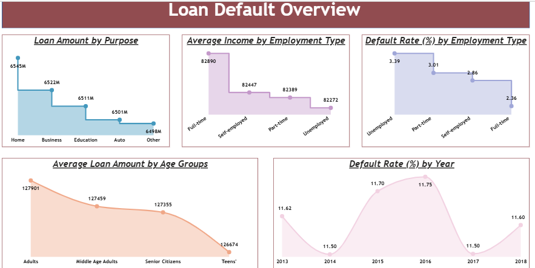
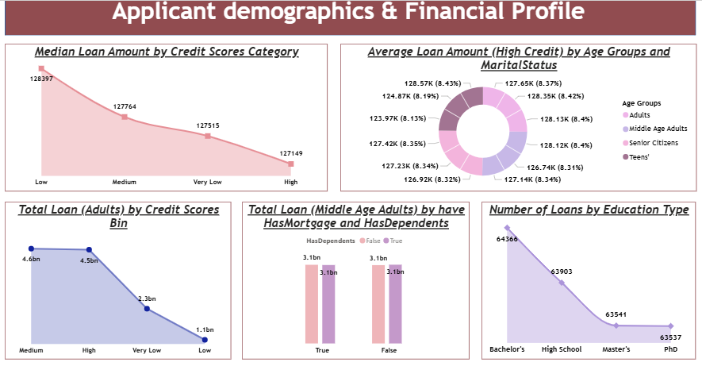
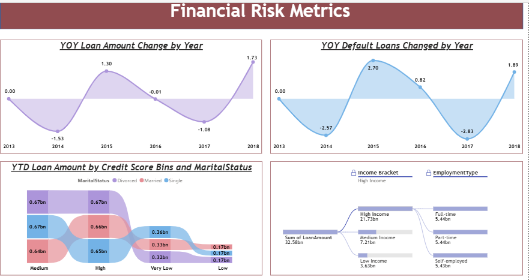

# 📊 Power BI Loan Dashboard

## 📄 Report Description
This repository contains my **Power BI Loan Dashboard Project**, built to analyze loan amounts, defaults, and year-over-year (YOY) changes.  
The report provides clear and interactive visualizations to uncover financial trends and risk factors.

---

## 📂 Files
- `PowerBI Dashboard Report.pbix` → Power BI project file

---

## 📌 Key Insights
- Loan Default Overview  
- Applicant Demographics & Financial Profile  
- Financial Risk Metrics  

---

## 🖼️ Dashboard Preview
  
  
  

---

## 🚀 How to Use
1. Clone this repository:
   ```bash
   git clone https://github.com/muhammadmoiz367/powerbi-loan-dashboard.git
